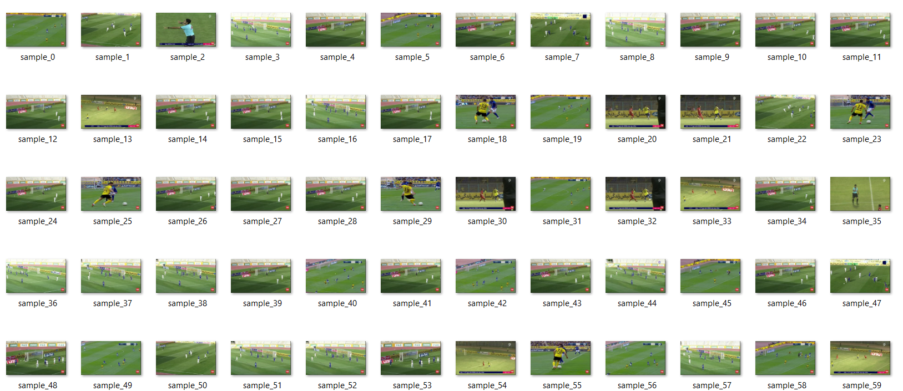

<a href="https://colab.research.google.com/drive/167NE06u9RtpaVdpN2cnXgP16OoKF7aMx"></a>

# Iranian Footaball Detection (IFD)

### Train YOLOv5

In this project, we try the YOLOv5 model on our custom data set. To train the model, we utilize the GPU in Colab. The properties of this GPU are shown below:

```
Tue Aug 16 06:47:37 2022       
+-----------------------------------------------------------------------------+
| NVIDIA-SMI 460.32.03    Driver Version: 460.32.03    CUDA Version: 11.2     |
|-------------------------------+----------------------+----------------------+
| GPU  Name        Persistence-M| Bus-Id        Disp.A | Volatile Uncorr. ECC |
| Fan  Temp  Perf  Pwr:Usage/Cap|         Memory-Usage | GPU-Util  Compute M. |
|                               |                      |               MIG M. |
|===============================+======================+======================|
|   0  Tesla T4            Off  | 00000000:00:04.0 Off |                    0 |
| N/A   38C    P8     9W /  70W |      0MiB / 15109MiB |      0%      Default |
|                               |                      |                  N/A |
+-------------------------------+----------------------+----------------------+
                                                                               
+-----------------------------------------------------------------------------+
| Processes:                                                                  |
|  GPU   GI   CI        PID   Type   Process name                  GPU Memory |
|        ID   ID                                                   Usage      |
|=============================================================================|
|  No running processes found                                                 |
+-----------------------------------------------------------------------------+
```

### Data set preparation

Our data set contains 100 images in 2 Player, and Ball classes. We use this data set to customize the YOLO algorithm weights based on some related categories of images with our dataset.



* 80% of images were placed in the training set, and 20% were separated as validation and test sets.
* For annotating we use [Makesense.ai](Makesense.ai) tool. Here's an example:
```
1 0.357311 0.475853 0.025943 0.029396
1 0.150943 0.582939 0.021226 0.029396
0 0.600825 0.448557 0.038915 0.163778
0 0.859670 0.535695 0.044811 0.178475
0 0.785967 0.653279 0.069575 0.203672
```
### Import model

In the first step, we need to clone the YOLOV5 repository and install requirements.txt. Models and datasets download automatically from the latest YOLOv5 release.
```
!git clone https://github.com/ultralytics/yolov5 
%cd yolov5
%pip install -qr requirements.txt  

import torch 
import utils 
display = utils.notebook_init()  
```
Our data set is uploaded manually using following command:
```
!unzip -q ../Iranian-Football-Detection.zip -d ../
```
And here's the custom [yaml](YOLOv5/IFD.yaml) for our data set:
```
train: ../Iranian-Football-Detection/  # train images
val: ../Iranian-Football-Detection/  # val images

# Classes
nc: 2  # number of classes
names: ['player', 'ball']  # class names
```
As an example, the small version of YOLOv5 is trained by the following code:
```
!python train.py --img 640 --batch 32 --epochs 200 --data IFD.yaml --weights yolov5s.pt --cache
```

### The training results

The summary of the training procedure for YOLOv5s:
Model summary: 213 layers, 7015519 parameters, 0 gradients, 15.8 GFLOPs

|Class  |   Images | Instances  |   P    |  R  |   mAP@.5 | mAP@[.5,.95] |
| :---: | :---: | :---: | :---: | :---: | :---: | :---: |
|  all  |  100  |  883  |  0.983  |  0.984  |  0.992  |  0.615  |
|  player  |  100  |  734  |  0.987  |  0.995  |  0.995  |  0.761  |
|  ball  |  100  |  149  |  0.979  |  0.973  |  0.99  |  0.468  |


### Applying train weights

Here's the command for applying custom weights and its result on test set:
```
!python detect.py --weights runs/train/exp/weights/best.pt --img 640 --conf 0.25 --source ../sample_1.mp4
```
<p float="center">
  
   
</p>

### How to contribute to Soccer-Detection

We use the Fork and Pull Request model for contribution. For more information read the [CONTRIBUTE.md](https://github.com/klammhsa/Soccer-Detection/blob/main/CONTRIBUTE.md).

### Contributors
- [Kiana Hooshanfar](https://www.github.com/K-Hooshanfar)
- [Mahsa Kalam](https://www.github.com/klammhsa)
